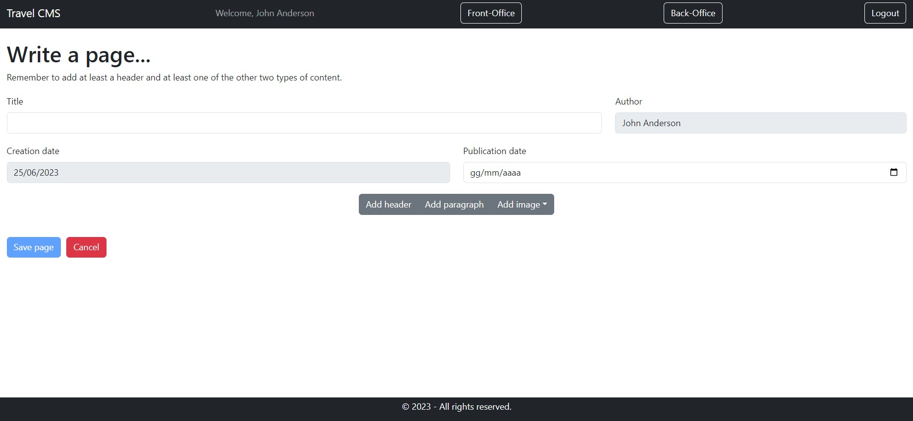

[](https://classroom.github.com/a/8AapHqUJ)
# Exam #1: "CMSmall"
## Student: s317904 SCHERMA VANESSA 

## React Client Application Routes

- Route `/`: display the list of published pages
- Route `/pages/:id`: display the properties and the full content of page #id
- Route `/pages`: display the list of all pages (published, draft and scheduled)
- Route `/add`: display the form to add a new page, including its properties and contents
- Route `/pages/:id/edit`: display the form to edit page #id (both properties and contents)
- Route `/login`: display the form to execute the login
- Route `*`: diplay a default page in case of unexisting URLs

## API Server

- GET `/api/sessions/current`
  - request parameters: credentials for passport authentication
  - request body: none
  - response body: user info
  - response status: 200 OK, 401 Unauthorized

- POST `/api/sessions`
  - request parameters: credentials for passport authentication, content-type application/json
  - request body: credentials
  - response body: user info
  - response status: 201 Created (successful login), 401 Unauthorized (wrong credentials)

- DELETE `/api/sessions/current`
  - request parameters: credentials for passport authentication
  - request body: none
  - response body: none
  - response status: 200 OK (successful logout)

- GET `/api/pages`
  - request parameters: credentials for passport authentication
  - request body content: none
  - response body: array of objects, each describing one page:
  ``` json
  [
    {
      "id": 1,
      "title": "Mountain Adventures: Exploring Nature's Majesty",
      "authorId": 0,
      "creationDate": 2023-06-20,
      "publicationDate": null
    },
    {
      "id": 2,
      "title": "Summer Destinations of 2023: Where to Go for Unforgettable Adventures",
      "authorId": 0,
      "creationDate": 2023-06-20,
      "publicationDate": null
    },
    ...
  ]
  ```
  - response status: 200 OK, 500 Internal Server Error

  - GET `/api/pages/:id`
    - request parameters: credentials for passport authentication
    - request body content: none
    - response body: one object describing the required page:
    ``` json
    [
      {
        "id": 1,
        "title": "Mountain Adventures: Exploring Nature's Majesty",
        "authorId": 0,
        "creationDate": 2023-06-20,
        "publicationDate": null
      }
    ]
    ```
    - response status: 200 OK, 401 Unauthorized, 404 Not Found, 500 Internal Server Error

  - GET `/api/pages/:id/contents`
    - request parameters: none
    - request body content: none
    - response body: array of objects, each describing a content of the required page:
    ``` json
    [
      {
        "id": 1,
        "type": "paragraph",
        "body": "In this travel article, we will delve into the world of mountains and discover some of the most fascinating and awe-inspiring destinations to visit.",
        "pageId": 1,
        "pageOrder": 2
      },
      {
        "id": 2,
        "type": "header",
        "body": "Introduction",
        "pageId": 1,
        "pageOrder": 1
      },
      ...
    ]
    ```
    - response status: 200 OK, 404 Not Found, 500 Internal Server Error

  - POST `/api/pages`
    - request parameters: credentials for passport authentication, content-type application/json 
    - request body content: description of the page to add, array with descriptions of the contents to add
    ``` JSON
    {
      "title": "New title",
      "authorId": 0,
      "creationDate": 2023-06-20,
      "publicationDate": 2023-06-27
    },
    [
      {
      "type": "header",
      "body": "Introduction",
      "pageId": 10,
      "pageOrder": 1
      },
      ...
    ]
    ```
    - response body: null
    - response status: 200 OK, 401 Unauthorized, 422 Unprocessable Entity, 503 Service Unavailable

  - PUT `/api/pages/:id`
    - request parameters: credentials for passport authentication, content-type application/json 
    - request body content: description of the page to update, array with description of the contents to update or to add
    ``` JSON
    {
      "id": 10,
      "title": "New updated title",
      "authorId": 0,
      "creationDate": 2023-06-20,
      "publicationDate": 2023-06-27
    },
    [
      {
      "type": "header",
      "body": "Introduction",
      "pageId": 10,
      "pageOrder": 1
      },
      ...
    ]
    ```
    - response body: success message
    - response status: 200 OK, 401 Unauthorized, 404 Not Found, 422 Unprocessable Entity, 503 Service Unavailable

  - DELETE `/api/pages/:id`
    - request parameters: credentials for passport authentication
    - request body content: none
    - response body: an empty object
    - response status: 200 OK, 401 Unauthorized, 503 Service Unavailable
  
  - GET `/api/users`
    - request parameters: none
    - request body content: none
    - response body: array of objects, each describing one user (just id and name):
    ``` json
    [
      {
        "id": 0,
        "name": "John Anderson"
      },
      {
        "id": 1,
        "name": "Thomas Miller"
      },
      ...
    ]
    ```
    - response status: 200 OK, 500 Internal Server Error

   - GET `/api/website`
    - request parameters: none
    - request body content: none
    - response body: name of the website:
    ``` json
    [
      {
        "name": "Travel CMS"
      }
    ]
    ```
    - response status: 200 OK, 500 Internal Server Error

  - PUT `/api/website`
    - request parameters: credentials for passport authentication, content-type application/json 
    - request body content: name of the website
       ``` json
    [
      {
        "name": "New Travel CMS"
      }
    ]
    ```
    - response body: none
    - response status: 200 OK, 503 Service Unavailable

## Database Tables

- Table `user` - contains id, email, password, salt, name, admin
- Table `page` - contains id, title, authorId, creationDate, publicationDate
- Table `content` - contains id, type, body, pageId, pageOrder
- Table `website` - contains name

## Main React Components

- `NavHeader` (in `NavbarComponents.jsx`): navigation header with dynamic behavior, such as fetching and displaying the website name, allowing admins to edit it, and rendering different links and buttons based on authentication status and user roles.

- `LoginForm` (in `AuthComponents.jsx`): form that can be used in the application to handle authentication and user sessions.

- `FrontLayout` (in `PageLayout.jsx`): it allows to see the published pages in chronological order (composed by `PageTable`).

- `BackLayout` (in `PageLayout.jsx`): it allows logged-in users to see all the pages (composed by `PageTable`).

- `AddLayout` (in `PageLayout.jsx`): it allows logged-in users to create a new page (composed by `PageForm`).

- `EditLayout` (in `PageLayout.jsx`): it allows logged-in users to edit a page they are the authors of (if a regular user) or any page (if an admin) (composed by `PageForm`).

- `NotFoundLayout` (in `PageLayout.jsx`): default page displayed in case of unexisting URLs.

- `PageTable` (in `PageTable.jsx`): table with rows for each page, with navigation links to the single page. It includes, for logged-in users only, edit functionality and a delete confirmation modal for each page.

- `SinglePage` (in `SinglePageComponents.jsx`): it displays the page's title, author, creation date, publication status, and the actual contents of the page using appropriate components based on their types (header, paragraph or image).

- `PageForm` (in `PageForm.jsx`): form for creating or updating pages. It utilizes React hooks to manage form state and provides various functions for handling form interactions.

- `Footer` (in `Footer.jsx`): it renders copyright information.

## Screenshot




## Users Credentials

- email: user1@gmail.com --- password: password1 --- admin: no

- email: user2@gmail.com --- password: password2 --- admin: no

- email: user3@gmail.com --- password: password3 --- admin: no

- email: admin@gmail.com --- password: passwordadmin --- admin: yes
